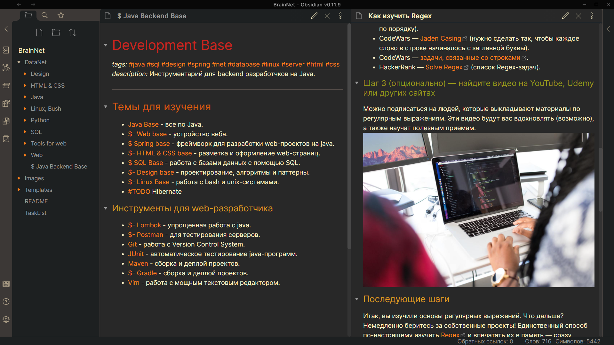
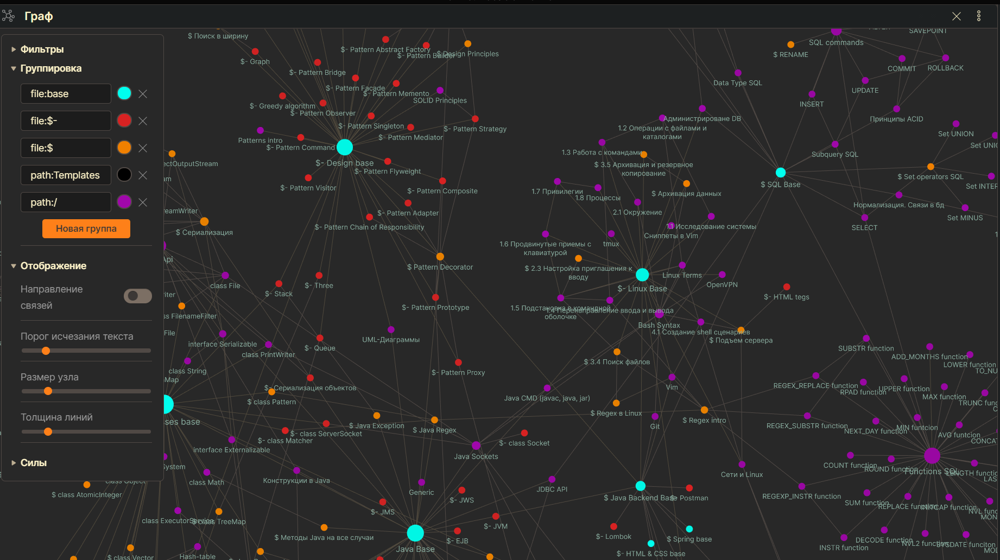

# BrainNet
***BrainNet*** - новая концепция по созданию сети структурированных и взаимосвязанных знаний по программированию. `Цель BrainNet` - свести процесс освоения профессий в сфере IT к оптимальному соотношению простоты и качества. Чтобы понять, что такое BrainNet, необходимо полностью ознакомиться с этой статьей.

P.S. Проект только начал развиваться, и некоторые вещи еще не реализованы.





### Почему стоит учиться в BrainNet и чем эта сеть отличается от Википедии, Хабра, JavaRush...?
Все эти сайты действительно напоминают BrainNet, но в каждом из них есть много минусов, отличий и ограничений, которые не позволяют легко и эффективно добиваться действительно убойных результатов в карьерном пути (в чем и заключается цель BrainNet). Приведу некоторые из них:
- `Графы и их структура`. Граф позволит вам увидеть все знания (узлы) и связи между ними. Вы сразу же начнете хорошо представлять, насколько то или иное знание является сложным и с чем связана эта тема. Граф также имеет раскраску, которая очень помогает в нем ориентироваться. Пока что эта раскраска помогает увидеть узлы, которые не разобраны или не начаты, но можно придумать этому более крутое применение.
- `Универсальные руководства и готовые планы обучений`. BrainNet позволяет с легкостью формировать любые руководства и планы обучения самым разным IT-профессиям. Достаточно создать файл с указанием ссылок на те темы, которые необходимо освоить для этой профессии. Проблема лишь в том, что эти темы могут быть неготовы, и их придется самостоятельно создавать (зато это позволит вам лучше ее освоить). Не стоит недооценивать эту возможность BrainNet, и чтобы ее понять, нужно присоединиться к сети и зайти в любой имеющийся файл по освоению какой-нибудь профессии.
- `Уникальная среда`, в которой существует BrainNet. Речь о приложении [Obsidian](https://www.youtube.com/watch?v=thA3xorIb0U) (в видео далеко не все преимущества obsidian). Данная среда имеет целый ряд важных преимуществ:
	- **Широчайшие настройки**. Obsidian - это текстовый редактор, напоминающий [vs code](https://code.visualstudio.com),
	- [MarkDown](https://lifehacker.ru/chto-takoe-markdown/) файлы. Все файлы в obsidian являются markdown, что дает нам очень много возможностей. Например мы можем открыть хранилище obsidian в другом текстовом редакторе и с легкостью вносить глобальные изменения, например делать замену строк. Обсидиан также поддерживает язык `LaTex`.
	- **Большое количество готовых плагинов и возможность создавать свои**. В obsidian можно найти большое количество разнообразных сторонних плагинов, а если нужных не будет, то вы можете написать свои. Также вы можете открывать хранилище obsidian в других текстовых редакторах и использовать плагины этих редакторов.
	- **Скорость работы**. Obsidian прекрасно работает, никогда не тормозит и мгновенно строит огромные графы, которыми можно впечатляюще управлять.
	- **Многообразие тем и стилей**. Obsidian может выглядеть как угодно, и если вы не умеете создавать свое оформление, вы можете использовать готовые темы, выбрав их в `Настройки -> оформление -> просмотр темы сообщества`. Тем там очень много, но на гитхабе можно найти их еще больше.
	- **Удобная работа со ссылками**. Obsidian можно настроить так, чтобы при наведении на ссылку у вас отображалась мини-версия содержимого этой ссылки. Отображение и переход по ссылкам можно настроить как угодно. Например можно сделать, чтобы при открытии ссылки они открывались в специальной боковой панели. 
	- **Кросплатформенность**. Obsidian даже входит в предустановленные магазины популярных дистрибутивов Linux.
	- **Наглядные и широко настраиваемые графы**. Obsidian позволяет отображать все знания в виде взаимосвязанных связей. Помимо основного графа, можно также отображать локальные графы, и устанавливать разные уровни глубины отображения. Графы имеют широкие настройки, темы и их можно раскрашивать.
- `Простая и надежная система поддержки сети`. Каждый желающий может с легкостью внести свои изменения, а модераторы удостоверятся в правильности информации и соблюдении правил. Если в сеть случайно попадет ложная или лишняя информация, ее смогут быстро обнаружить и устранить. Данная сеть может принести большую пользу всем, кто захочет к ней присоединиться, поэтому ожидается стремительный рост комьюнити этой сети.

### Основные идеи BrainNet
- **Идея [второго мозга](https://www.youtube.com/watch?v=cgaktoUoDVQ)**. Да, изначально это не ваш второй мозг, и от чтения статей вашим он навряд ли станет. Чтобы этот мозг стал частью вас, необходимо практиковаться. До создания практических заданий пока не дошло, но теории уже достаточно. В настоящий момент в BrainNet уже имеются ключевые статьи, содержащие в своем название слово base, скоро также появятся планы обучения с последовательными шагами. `Base` узлы связывают основные знания и позволяют легко ориентироваться в сети.
- **Идея открытости и коллективной разработки**. Именно эта идея обеспечит проекту постоянное развитие. Каждый участник сети сможет внести свои улучшения и развивать эту сеть. Если кто-то встретит непонятные или недостаточно разъясненные для него темы, он сможет их дополнить, и тема станет для всех понятнее. Конечно, для этой идеи, как и для всех остальных (кроме следующей) имеются определенные рамки, выйти за которые не получится, однако как раз к разрыву этих рамок и приближается прогресс, и увеличивающее количество умных программистов этот прогресс ускоряет.
- **Собственно, идея о разрыве рамок**. Эту идею необязательно понимать или воспринимать всерьез, чтобы осваивать BrainNet. В мире уже собрано достаточно оснований, чтобы начинать задумываться об этой идее. Сам термин [BrainNet](https://ru.wikipedia.org/wiki/Нейронет) подобран для названия сети не случайно. Мы осваиваем информацию органами, доставшимися нам от диких предков. Эти органы не предназначены для изучения больших объемов информации. К тому же, человек эволюционно стремиться к экономии энергии, а [мозг является очень энергозатратным органом](https://www.youtube.com/watch?v=hpXNNM_40do). И тем не менее, мы уже можем работать над созданием "внешнего коллективного мозга". Под этими словами я подразумеваю единую сеть взаимосвязанных и обновляющихся знаний.

### Как получить максимум пользы?
- Чтобы избежать [синдрома вечного студента](https://disshelp.ru/blog/sindrom-vechnogo-studenta-chto-eto-i-zachem-tak-mnogo-uchitsya/), необходимо фиксировать свой прогресс. Отличный вариант - рисование карты в [XMind](https://www.xmind.net). Например такой:
[XMind-map example](Images/example3.png)

- Думать над тем, как улучшить каждую статью, какие связи можно в нее добавить и какие упражнения стоит выполнить, чтобы статья усвоилась. Если у вас будут на этот счет идеи, обязательно делайте коммиты, и мы их рассмотрим. <? Дописать и добавить ссылку на инструкцию по внесению правок ?>

## Установка и настройка
1. Для начала вам необходимо скачать [Obsidian](https://obsidian.md/download) и [GitHub Desktop](https://desktop.github.com).
2. После установки GitHub Desktop отрываете эту программу, выбираете File -> Clone a repository -> URL и вводите:
	```bash
	git clone https://github.com/Denis-VR/BrainNet.git
	```
	После этого у вас должна появиться директория BrainNet.
3. Открываем obsidian, жмем "Открыть папку как хранилище" и выбираем директорию BrainNet


<?## Как внести свой вклад
## Как внести свой вклад?
Во-первых необходимо внимательно изучить правила для внесения изменнеий в сеть.
### Какие правила нужно соблюдать, чтобы внести изменения?

  ?>
## От автора
Надеюсь, что данная сеть принесет вам много пользы и позволит осваивать любые профессии, связанные с программированием. Поэтому ожидаю появления людей, которые займутся разными сферами. Пока что сеть направлена на освоение профессии разработчика на java, но если добавить немного информации, сеть будет подходить для подготовки администраторов баз данных, full-stack программистов и администраторов сетей.